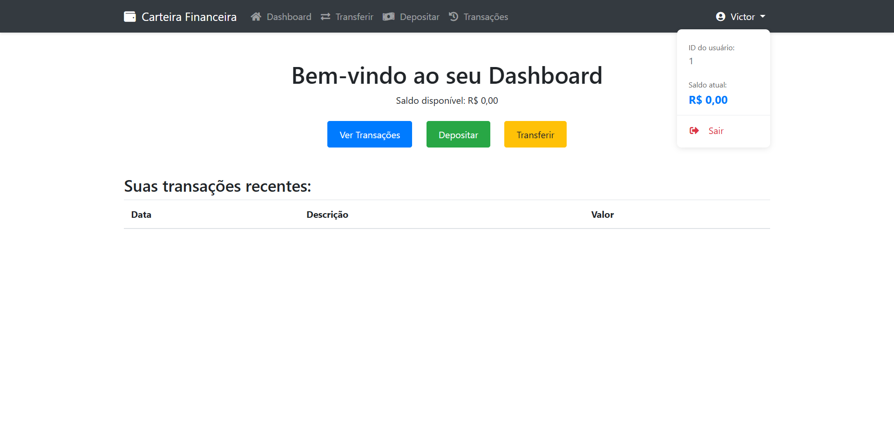

# Aplicação de Amostra de Carteira Finaceira


## Tecnologias Utilizadas:

-PHP <br/>
-Laravel <br/>
-SQLite <br/>
-Bootscrap <br/>
-Javascript <br/>

## Credenciais:

### Email e senha para teste:

Email: exemplo@teste.com.br <br/>
Senha: 12345678


## Como testar:

```bash
# Faça o clone do repositório  
# Copie o arquivo .env.example que está na raiz do projeto e depois renomeie para .env
# Execute o seguinte comando também na raiz para gerar a key: 

$ php artisan key:generate

# Depois, execute o seguinte comando para rodar as Migrations: 

$ php artisan migrate

# Após os passos acima, execute o seguinte comando para rodar a aplicação:

$ php artisan serve
```
 


